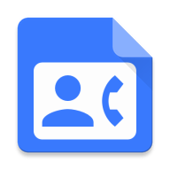

## Contact Loader

The offline app for showing essential Android Skill that reading device's contacts, Just for playing in code!

## Skill set
**- RxJava & RxAndroid:** for schedule search typing.

**- Glide:** Load image and cache.

**- Butterknife:** Binding view & click event.

**- Gson:** convert object Parcelable.

**- RecyclerView:** create FlexibleWidthRecyclerView for selected contact & Sticky header for Device's Contact list.
**- Contact:** Reading the contact DB for special requirement.
**- SortedList:** Make every item always in order.

## Screen-shot

1.MainActivity | 2.ContactList
--- | ---
 | 

3.Search Contact | 4.Contacts selected and Search bar
---- | ----
 | 

**1. MainActivity:** Start page you should be asking for access contact permission right here.

**2. ContactList:** The contact list show all contact inside device with key is contact name, phone number will be merger as one contact name and more phone number.

**3. Search Contact:** Selected contacts will be showing beside of the search text input.

**4. Contacts selected and Search bar:** When the content width lager than 2/3 screen width, The RecyclerView's width must be set 2/3 parent's width.

## Installation
Using the lasted Android studio give you the best response when run this code.

## TODO
**1. UNIT test:** For robust code.

**2. Handle contact change:** When app in background (Add new, Delete, Update contact).

Thankful
-------
I wanna give special thank to Jake Wharton and his team for provide great libs, the Google's Android OS development team for create great platfrom that open source!

License
-------
Apache 2.0. See the [LICENSE][1] file for details.

[1]: https://github.com/AnhLeAit/ContactLoader/blob/master/LICENSE
